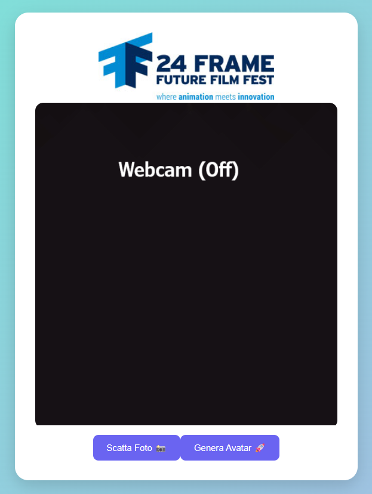
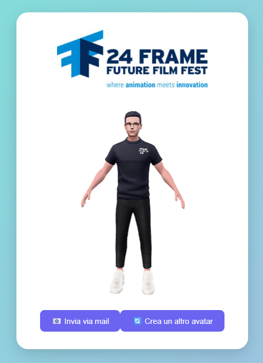

# 3D Character Creator - 24 Frame Future Film Fest 🎬

Un'applicazione demo interattiva creata per il **24 Frame Future Film Fest**, pensata per essere installata in totem fisici e coinvolgere un pubblico giovane tramite la generazione del proprio personaggio 3D.

An interactive demo app developed for the **24 Frame Future Film Fest**, designed to run on physical kiosks (totems) and engage a younger audience through personalized 3D character creation.

---

## 📸 Obiettivo / Goal

🎯 L'obiettivo del progetto è attrarre giovani tra i 18 e i 30 anni al festival, la cui audience attuale è composta prevalentemente da adulti e anziani.  
L'app è pensata per essere installata all'interno di totem interattivi posizionati in università, biblioteche, eventi o altri spazi pubblici.  
Offre un'esperienza immersiva che permette ai partecipanti di scattare una foto, generare il proprio personaggio 3D e visualizzarlo in tempo reale, stimolando curiosità e coinvolgimento.

🎯 The goal is to attract young people (ages 18–30) to the festival, whose current audience mainly consists of older adults.  
The app is designed to run on interactive kiosks placed in universities, libraries, events, or other public spaces.  
It offers an immersive experience where users take a photo, generate their own 3D character, and view it live — sparking curiosity and increasing engagement.

---

## ⚙️ Tecnologie usate / Technologies used

- **Frontend**: React + Vite  
- **Backend**: Python + Flask  
- **API**: Ready Player Me  
- **3D Viewer**: `<model-viewer>`  
- **Ambiente**: Google Colab `.ipynb`

---

## 🚀 Come eseguire / How to run

### 📚 In Colab / In Colab

1. Apri ed esegui il file `CharacterCreator.ipynb` su Google Colab  
2. Carica il file `frontend.zip` quando richiesto  
3. Esegui tutte le celle fino in fondo  
4. Clicca sul link generato, ad esempio:  
   **https://localhost:8084/**

Questo aprirà l'applicazione React con supporto webcam integrato, pronta per generare un personaggio.

1. Open and run the `CharacterCreator.ipynb` file in Google Colab  
2. Upload the `frontend.zip` file when prompted  
3. Run all the cells until the end  
4. Click on the generated link, for example:  
   **https://localhost:8084/**

This will launch the React app with integrated webcam support, ready to generate your character.

---

## 🖼️ Demo

  
  

---

## 🧠 Estensioni future / Future ideas

- Installazione in un totem fisico durante il festival
- Integrazione con ambienti virtuali e visori VR
- Generazione automatica di corti animati tramite prompt (es. con AI generativa)
- Eventi online interattivi per coinvolgere la community anche durante l’anno

 

- Integration into a physical totem during the festival  
- Compatibility with VR headsets and virtual environments  
- Automatic generation of animated shorts using creative prompts (e.g., generative AI)  
- Year-round online events to maintain community engagement

---

## 📬 Contatti / Contacts

> Progetto dimostrativo realizzato per il Future Film Fest 2025 con finalità educative e promozionali.  
> Demo project created for Future Film Fest 2025 for educational and promotional purposes.
